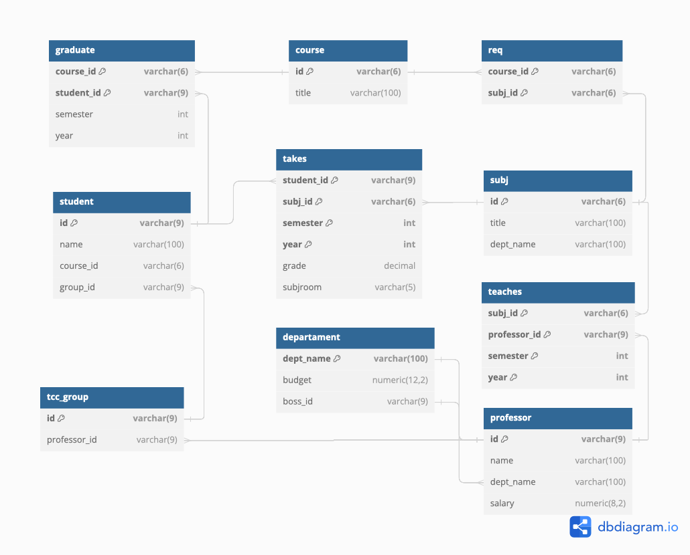

<h1>Projeto Banco de Dados</h1>

> Status: Finalizado (13 de Maio, 2024)

## Alunos

Enzo Bozzani - R.A.: 24.122.020-1
<br>
Igor Augusto Fiorini Rossi - R.A.: 24.122.023-5
<br>
Luca Anequini Antoniazzi - R.A.: 24.122.032-6

## Diagrama:



## Rodar aplicação:

1. Iniciar um terminal SQL (seja local ou em nuvem)

2. Criar banco:

```
CREATE DATABASE projeto_banco_de_dados;
```

3. Conecte-se ao banco criado:

    - no CockroachLabs, por exemplo, selecione o banco no select em cima do terminal
    - no terminal local (postgres):
        ```
        \c projeto_banco_de_dados;
        ```

4. Criar tabelas:

```
-- Copiar e colar conteúdo do arquivo migration.sql
```

5. Inserir os dados:

```
-- Copiar e colar conteúdo do arquivo seeder.sql
```

6. Fazer as consultas (disponíveis no arquivo queries.sql)
